  

  <h1>Ayush Singh</h1>

  

    <strong>AI/ML Developer</strong> building practical LLM systems, agent workflows, and production-minded machine learning.
  

  

  

    
    
    
  

<table align="center">
  <tr>
    <td align="center" width="220">
      <b>Currently</b> 
      Exploring AI agents and LLM tooling
    </td>
    <td align="center" width="220">
      <b>Core Stack</b> 
      Python · TensorFlow · FastAPI
    </td>
    <td align="center" width="220">
      <b>Build Style</b> 
      Useful, clean, and production-aware
    </td>
  </tr>
</table>

---

## 🚀 About Me

<table>
  <tr>
    <td width="60">
      
    </td>
    <td><b>Building practical AI systems</b> LLM apps, agent workflows, and ML projects that can leave the notebook.</td>
  </tr>
  <tr>
    <td>
      
    </td>
    <td><b>LLMs, AI agents, and real-world ML</b> Curious about systems that are useful, measurable, and easy to iterate.</td>
  </tr>
  <tr>
    <td>
      
    </td>
    <td><b>Production-minded experiments</b> Training, evaluating, and shipping with fewer mystery failures.</td>
  </tr>
  <tr>
    <td>
      
    </td>
    <td><b>Always learning in public</b> Trying to turn ideas into small, working things before they get too precious.</td>
  </tr>
</table>

---

## 🛠️ Tech Arsenal

  

<picture>
  <source media="(prefers-color-scheme: dark)" srcset="https://raw.githubusercontent.com/AyushSinghRana15/AyushSinghRana15/output/github-contribution-grid-snake-dark.svg" />
  <source media="(prefers-color-scheme: light)" srcset="https://raw.githubusercontent.com/AyushSinghRana15/AyushSinghRana15/output/github-contribution-grid-snake.svg" />
  
</picture>

## 📊 GitHub Stats

  
  

  <i>"I don't always test my code, but when I do, I do it in production."</i>

